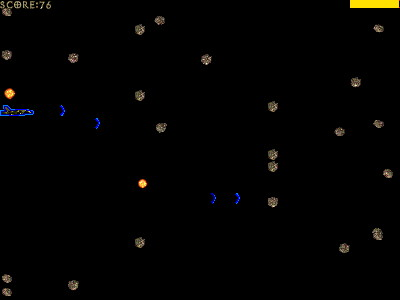



## DirectX Game \(must see\!\!\)

### Description

This is a start to an Asteroids/Gradius clone. Almost all of the program is documented. It demonstrates how to use DirectX features such as: DirectDraw, Sprites, DirectInput, Collision Detection, Playing Midi's, Playing Wav's, Sound Buffers, etc. You really have to check this out, it could really help you learn DirectX. Also, please vote and give comments.
 
### More Info
 
You should have DirectX 7 installed on the computer.

This program has had some problems with several systems. On some the sounds stop playing after a while, and on others the program may not load. If this occurs, change the sprites height and width. (make it smaller)

             |
---                |---
**Submitted On**   |2000-09-01 23:26:58
**By**             |[Odin](https://github.com/Planet-Source-Code/PSCIndex/blob/master/ByAuthor/odin.md)
**Level**          |Intermediate
**User Rating**    |4.8 (19 globes from 4 users)
**Compatibility**  |VB 5\.0, VB 6\.0
**Category**       |[DirectX](https://github.com/Planet-Source-Code/PSCIndex/blob/master/ByCategory/directx__1-44.md)
**World**          |[Visual Basic](https://github.com/Planet-Source-Code/PSCIndex/blob/master/ByWorld/visual-basic.md)
**Archive File**   |[CODE\_UPLOAD98739132000\.zip](https://github.com/Planet-Source-Code/odin-directx-game-must-see__1-11460/archive/master.zip)

